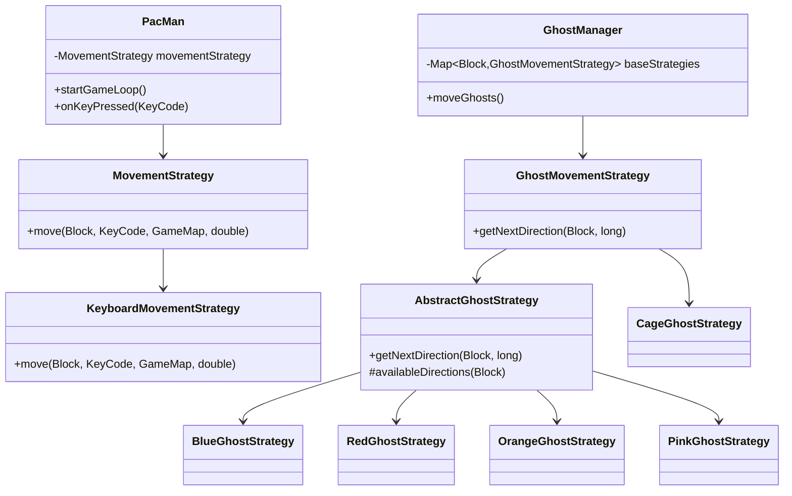
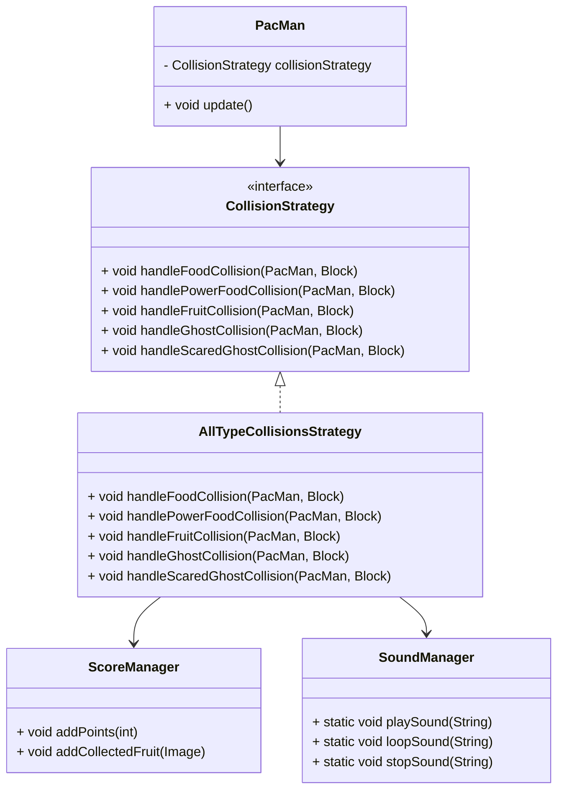
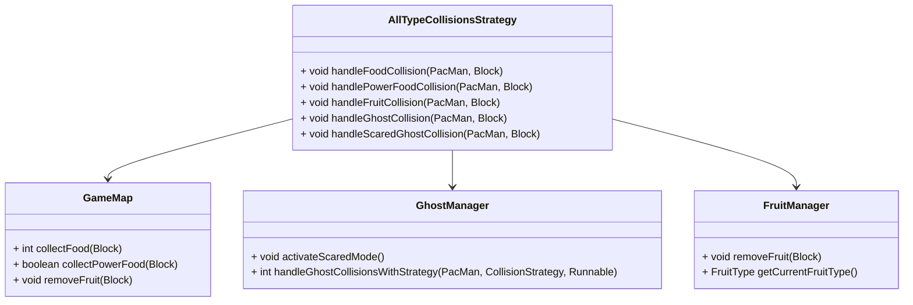

# Relazione finale PacMan 2.0 | Corso Progettazione e Sviluppo del Software - A.A. 2024/2025 | Laurea in Tecnologie dei Sistemi Informatici - UNIBO

## ANALISI

Il progetto consiste nella realizzazione di un applicativo che permetta agli utenti di rivivere l’emozione del classico Pac‑Man, uscito per la prima volta nel 1980, con un’interfaccia e un’architettura modernizzate pur conservando il gameplay originale.

Il software Pac‑Man offre al giocatore la possibilità di controllare l’iconico personaggio giallo in un labirinto popolato da puntini da mangiare (dots) e fantasmi ostili. L’obiettivo è raccogliere tutti i punti presenti nella mappa evitando i quattro fantasmi, ciascuno con comportamenti di movimento caratteristici: quando si raccolgono le “power‑pill” si attiva temporaneamente la modalità “scared” che consente di mangiare i fantasmi per il punteggio extra. Completato il consumo di tutti i puntini, il livello avanza e, di tanto in tanto, compare una frutta bonus che conferisce ulteriori punti e occasionali poteri speciali come velocità aumentata o congelamento dei fantasmi.

### Requisiti

L'applicazione PacMan 2.0 dovrà soddisfare i seguenti requisiti funzionali:

* Il giocatore deve poter controllare il personaggio principale (PacMan) all'interno di un labirinto.

* Il labirinto deve contenere dei "dots" (cibo) che PacMan può raccogliere per accumulare punti.

* Devono essere presenti nemici (i fantasmi), che si muovono nel labirinto secondo un comportamento definito e non.

* Se un fantasma mangia PacMan, il giocatore perde una vita.

* Il gioco termina quando pacman perde tutte le vite.

* Devono essere previste condizioni di vittoria e di sconfitta.

* Il punteggio del giocatore deve essere aggiornato in tempo reale.

* Devono essere presenti elementi di interazione dinamica:

  * dots speciali che modificano temporaneamente il comportamento dei fantasmi.

* Il gioco deve essere rigiocabile, ovvero il giocatore può iniziare una nuova partita una volta terminata quella corrente.

Eventuali requisiti aggiuntivi rispetto al gioco originale (PacMan 2.0):

* Devono essere introdotti "poteri" speciali per PacMan

* Aggiungere una sezione "skin" al menù iniziale.

### Analisi e modello del dominio

Pac‑Man consente al giocatore di impersonare l’omonimo personaggio giallo all’interno di un labirinto, con lo scopo di mangiare prima tutti i puntini, poi le pillole potenziate e infine la frutta bonus  che compare al centro del percorso. Pac‑Man, può muoversi nelle quattro direzioni grazie agli input tastiera e raccogliere le entità commestibili; allo stesso modo, quattro fantasmi ostili – Rosso, Blu, Rosa e Arancione – pattugliano il labirinto seguendo strategie di movimento diverse. Quando Pac‑Man ingerisce una pillola potenziata, entra in modalità “scared” per un tempo limitato e diventa in grado di mangiare i fantasmi, che una volta consumati vengono rimandati indietro alla gabbia temporanea prima di respawnare. Ogni entità di gioco estende il modello astratto e possiede un’immagine identificativa, per differenziare visivamente oggetti statici (muri, tunnel) e dinamici (personaggi).

```mermaid
classDiagram
    class EntitàGioco {
        +immagineIdentificativa
    }

    class PacMan {
        +muoveInQuattroDirezioni()
        +raccogliePuntini()
        +raccogliePillolePotenziate()
        +raccoglieFruttaBonus()
        +entraInModalitàScared()
        +mangiaFantasmi()
    }

    class Fantasma {
        +colore: String
        +segueStrategiaDiversa()
        +vieneMangiato()
        +tornaInGabbia()
        +respawna()
    }

    class Puntino
    class PillolaPotenziata
    class FruttaBonus
    class Muro
    class Tunnel

    EntitàGioco <|-- PacMan
    EntitàGioco <|-- Fantasma
    EntitàGioco <|-- Puntino
    EntitàGioco <|-- PillolaPotenziata
    EntitàGioco <|-- FruttaBonus
    EntitàGioco <|-- Muro
    EntitàGioco <|-- Tunnel

    PacMan --> Puntino : raccoglie
    PacMan --> PillolaPotenziata : raccoglio
    PacMan --> FruttaBonus : raccoglie
    PacMan --> Fantasma : mangia (in modalità Scared)

    Fantasma --> Gabbia : tornaDopoEssereMangiato

    class Gabbia
 

 ```

Uno dei requisiti aggiuntivi, ovvero l'implementazione di skin per rendere il gioco più divertente e piacevole, non è stato implementato a causa dei tempi che avrebbe richiesto.

## DESIGN
In questo capitolo vengono illustrate le scelte progettuali adottate per soddisfare i requisiti emersi durante la fase di analisi, con un’attenzione particolare alla struttura architetturale e all’uso del Strategy Pattern per la gestione dei comportamenti dinamici di movimento e collisione.

L’applicazione Pac‑Man 2.0 è stata organizzata in moduli chiari e indipendenti: il Game (classe PacMan) orchestratore centrale che coordina il ciclo di gioco, la mappa (GameMap), i manager di entità mobili (GhostManager, FruitManager) e il rendering. Ogni comportamento variabile – ad esempio il modo in cui Pac‑Man si muove (KeyboardMovementStrategy) o i differenti stili di inseguimento dei fantasmi (RedGhostStrategy, BlueGhostStrategy, ecc.) – sono incapsulati in una specifica implementazione dell’interfaccia MovementStrategy o GhostMovementStrategy. Analogamente, tutte le reazioni a collisioni (con cibo, power‑pill, muri o fantasmi) sono delegate a oggetti che realizzano l’interfaccia CollisionStrategy (ad es. AllTypeCollisionsStrategy), permettendo di estendere o modificare facilmente le regole di gioco senza toccare il core del motore grafico o della logica di alto livello.

Questa architettura modulare e basata su strategie rende l’applicazione estremamente flessibile, manutenibile e pronta per integrare nuovi comportamenti o modalità di gioco con interventi mirati sui singoli strategy.

### Architettura dei componenti

Il punto d’ingresso dell’applicazione è rappresentato dalla classe App.java, responsabile dell’inizializzazione dell’ambiente JavaFX. Questa classe mostra il menu principale, da cui è possibile avviare una partita o uscire dal gioco, e si occupa di avviare la schermata di gioco vera e propria.

Al centro della logica di gioco si trova PacMan.java, che gestisce il ciclo di vita della partita. Qui si coordinano l’avanzamento temporale e il movimento scelto dal giocatore. Questa classe funge anche da nucleo attorno al quale ruotano tutte le altre componenti, come ScoreBoard, GhostManager, GameMap e FruiManager.

La struttura della mappa è definita in GameMap.java, che rappresenta il labirinto in termini di disposizione dei blocchi, percorribilità e contenuti (come cibo e powerfood). È inoltre responsabile delle collisioni tra gli elementi statici del mondo e i personaggi in movimento. Utilizza i file di strategy per rendere accessibile ed intuitiva la logica associata.

Per astrarre la gestione delle direzioni, la classe Direction.java fornisce un modello semplice e chiaro che rappresenta i movimenti cardinali (su, giù, sinistra, destra). Questa astrazione semplifica notevolmente l’implementazione della logica di spostamento.

Il comportamento dei fantasmi è regolato da GhostManager.java, che alterna in modo dinamico diverse modalità (inseguimento, fuga, ritorno alla base) in base allo stato del gioco e alle interazioni con PacMan. Ogni fantasma può essere configurato con caratteristiche comportamentali differenti, arricchendo così la varietà dell’esperienza di gioco. Utilizza i file di Strategy per implementare tali movimenti.

La gestione dei frutti bonus e dei superpoteri è invece affidata a FruitManager.java, che si occupa di far comparire questi elementi in momenti prestabiliti della partita e di attribuire il relativo punteggio in caso di raccolta.

Infine, la classe Block.java rappresenta i singoli elementi del labirinto. Ogni blocco può essere un personaggio, una parete, uno spazio libero o contenere cibo o frutti. Questo approccio modulare consente una costruzione flessibile e facilmente modificabile della mappa di gioco.

```mermaid
classDiagram
    class App {
        +start()
        +showMainMenu()
        +launchGame()
    }

    class PacMan {
        +update()
        +move()
        +checkCollisions()
        +updateScore()
        +updateLives()
    }

    class GameMap {
        +loadMap()
        +getBlock(x, y)
        +isWalkable(x, y)
    }

    class Direction {
        +UP
        +DOWN
        +LEFT
        +RIGHT
        +fromInput(input): Direction
    }

    class GhostManager {
        +updateGhosts()
        +setMode(mode)
        +resetGhost(ghost)
    }

    class FruitManager {
        +spawnFruit()
        +checkCollection()
        +gay
    }

    class Block {
        +isWall : boolean
        +containsFood : boolean
        +containsPowerFood : boolean
        +containsFruit : boolean
        +getType()
    }

    %% Relazioni
    App --> PacMan : lancia
    PacMan --> GameMap : usa
    PacMan --> GhostManager : coordina
    PacMan --> FruitManager : coordina
    PacMan --> Direction : usa
    GameMap --> Block : contiene
```

Con questa struttura architetturale, è possibile estendere il gioco aggiungendo nuove entità (ad esempio nuovi tipi di bonus o nemici), senza dover modificare direttamente la logica centrale. Il controller PacMan funge da unico punto di orchestrazione, mantenendo così un elevato disaccoppiamento tra l’interfaccia e il dominio del gioco.

## Design Dettagliato

### Movements (Luca)

Nel gioco Pac‑Man era essenziale gestire movimenti diversi in modo flessibile: il giocatore deve rispondere esclusivamente ai tasti freccia, mentre ciascuno dei quattro fantasmi adotta comportamenti differenti (movimento casuale, inseguimento, fasi miste, ecc.). Scrivere tutta questa logica direttamente nelle classi principali avrebbe generato un codice rigido e difficile da estendere se per esempio si volesse aggiungere o modificare un nuovo fantasma.

Per risolvere il problema ho scelto il Strategy Pattern, introducendo due interfacce: MovementStrategy per Pac‑Man e GhostMovementStrategy per i fantasmi. Il comportamento di Pac‑Man è incapsulato in KeyboardMovementStrategy, che traduce la pressione dei tasti direzionali in spostamenti sul labirinto; i fantasmi condividono invece la logica di base definita in AbstractGhostStrategy e le sue specializzazioni concrete (BlueGhostStrategy, RedGhostStrategy, OrangeGhostStrategy e PinkGhostStrategy) ciascuna con il proprio algoritmo di inseguimento o casualità, mentre CageGhostStrategy gestisce l’uscita dalla gabbia (“ghost portal”) sempre in direzione verso l’alto.

Questa soluzione, rispetto all’alternativa di semplici switch o if su tipo di fantasma, mantiene il codice pulito e aperto a nuove strategie e modifiche.



### CollisionStrategy (Alessandro)
**- Problema:** Durante lo sviluppo di PacMan 2.0 è emersa la necessità di gestire in modo chiaro, modulare e scalabile le diverse collisioni tra Pac-Man e gli elementi della mappa: cibo, powerfood, frutti, muri e fantasmi (in stato normale o spaventato). Inizialmente, questa logica era sparsa in più classi (PacMan, GameMap, GhostManager), rendendo difficile la manutenzione del codice e l’aggiunta di nuovi comportamenti. Inoltre, le reazioni a ogni collisione (come l’aumento del punteggio o la riproduzione di suoni) erano gestite in modo rigido e distribuito.

**- Soluzione:** Per risolvere questo problema è stato adottato lo Strategy Pattern, progettando l’interfaccia CollisionStrategy che definisce i metodi per gestire i diversi tipi di collisione. All’interno della classe PacMan, la responsabilità di “cosa accade” durante una collisione viene quindi delegata a un’istanza concreta (AllTypeCollisionsStrategy), rendendo il codice più ordinato, testabile ed estendibile.

Questa struttura permette anche una facile integrazione con altri moduli. Quando Pac-Man mangia un cibo o un frutto, ad esempio, la strategia invoca i metodi del ScoreManager per aggiornare il punteggio e visualizzarlo nella scoreboard. In modo simile, quando raccoglie un powerfood, viene avviata la modalità “scared” dei fantasmi e viene riprodotto un suono continuo di sirena, tramite il metodo SoundManager.loopSound("siren_ghost"). La gestione audio è quindi integrata direttamente nella reazione alla collisione, garantendo coerenza temporale tra evento visivo e feedback sonoro.

Infine, grazie alla ScoreManager, ogni frutto raccolto viene anche salvato e visualizzato nella parte bassa della schermata, fornendo un elemento visivo persistente che riflette i progressi del giocatore. L’approccio modulare consente inoltre di aggiungere facilmente nuove regole di punteggio o effetti audio in futuro, semplicemente estendendo la strategia esistente o creandone una nuova.



### AllTypeCollisionStrategy (Stefano)
**- Problema:** Definita l’interfaccia CollisionStrategy, serviva un’implementazione concreta che centralizzasse tutta la logica delle collisioni. Questa logica doveva orchestrare l’interazione tra diversi sottosistemi: eliminazione del cibo dalla mappa, attivazione dello stato “scared” nei fantasmi, aggiornamento del punteggio, visualizzazione dei frutti raccolti, e riproduzione di suoni appropriati. Inoltre, la gestione della mappa (GameMap) doveva fungere da sorgente dati coerente per tutte queste operazioni, poiché è responsabile della rappresentazione e struttura logica del mondo di gioco.

**- Soluzione:** La classe AllTypeCollisionsStrategy è stata realizzata per implementare ogni metodo dell’interfaccia CollisionStrategy. Qui viene incapsulata la logica effettiva delle collisioni: handleFoodCollision() rimuove un cibo dalla lista interna della mappa e incrementa il punteggio; handlePowerFoodCollision() invoca il metodo activateScaredMode() del GhostManager per rendere vulnerabili i fantasmi, e handleFruitCollision() gestisce la scomparsa del frutto e l’eventuale attivazione di un potenziamento.

Il ruolo della mappa è centrale in questa struttura: definisce cosa si trova in ogni posizione e se esiste una collisione. Le sue liste di oggetti (cibo, powerfood, muri, frutti, fantasmi) sono interrogate dalla strategy per determinare lo stato corrente del gioco e modificarlo in modo reattivo. Senza una mappa coerente e dinamica, la strategia non potrebbe garantire l’integrità delle operazioni: ad esempio, rimuovere un cibo senza aggiornare la mappa causerebbe bug visivi e logici.

Inoltre, la mappa viene usata indirettamente anche per il pathfinding dei fantasmi e per la gestione dei tunnel, rendendo la sua precisione e affidabilità fondamentali anche per l’equilibrio del gameplay. La collaborazione tra la strategia di collisione e GameMap evidenzia l’importanza di una progettazione modulare, dove ogni componente ha responsabilità precise ma è progettato per collaborare con gli altri.



## Sviluppo

### Testing automatizzato

I file di test presenti all’interno del progetto nella directory src/test/java/com/pacman, sono stati sviluppati utilizzando il framework JUnit per verificare il corretto funzionamento di alcune funzionalità. Questo approccio consente di eseguire i test in modo automatico, garantendo che le funzionalità del software siano valide. Infine, uso di suite specifiche come JUnit è vantaggioso, poiché semplifica l'esecuzione e la gestione dei test, contribuendo a una maggiore efficienza nel processo di sviluppo del software.

#### GameMapTest
Questo set di test è dedicato a verificare che la classe GameMap carichi correttamente tutta la struttura di gioco a partire dalla rappresentazione a “tile map”. In particolare, il metodo loadMap_populatesWallsFoodsAndPacman() esegue le seguenti verifiche:

* Instanzia un ImageLoader e passa l’istanza a new GameMap(loader), forzando il parsing della mappa di caratteri.

* Controlla che la collezione di muri (getWalls()) non sia vuota, assicurando così che tutti i caratteri ‘X’ siano stati tradotti in blocchi murali.

* Verifica analogamente che la collezione di cibo normale (getFoods()) presenti almeno un elemento, a conferma che il simbolo spazio (‘ ’) venga correttamente interpretato.

* Recupera il blocco di Pac‑Man tramite getPacman(), controlla che non sia null e che le sue coordinate (x,y) siano all’interno dei limiti attesi (non negative).

* Infine, accerta la presenza di almeno due blocchi “tunnel” (getTunnels()), corrispondenti ai simboli ‘T’, per garantire che la logica di teletrasporto laterale sia disponibile.

Nel complesso, questi test garantiscono che il modello statico della mappa venga inizializzato in modo coerente e pronto per essere usato nelle fasi di gioco successive.

#### PacManMovementTest
Questo gruppo di test estende la copertura al comportamento dinamico di Pac‑Man, sfruttando direttamente la strategia KeyboardMovementStrategy in un ambiente di test headless. Per prima cosa, nel metodo initToolkit() del @BeforeAll viene invocato Platform.startup() per inizializzare il toolkit JavaFX in modo da poter caricare immagini e font anche fuori da un’applicazione grafica.
Nel test canMove_right_movesXPositive(), si posiziona Pac‑Man nella sua locazione iniziale e si registra la coordinata x di partenza. Si crea un’istanza di KeyboardMovementStrategy e si chiama move(pac, KeyCode.RIGHT, map, 1.0). L’asserzione assertTrue(pac.x > originalX) conferma che Pac‑Man effettivamente si sposta verso destra quando la direzione è libera.
Nel test cannotMove_intoWall_stopsAtBoundary(), invece, si forza Pac‑Man a x=0, y=0 (dove presumibilmente c’è un muro appena a sinistra) e si invoca move(..., KeyCode.LEFT, ...). L’asserzione assertEquals(0, pac.x) garantisce che la logica di collisione con i muri blocchi correttamente lo spostamento non consentito.

Questi due test insieme dimostrano che la strategia di movimento rispetta i vincoli di GameMap e che l’animazione “apri-chiudi” della bocca non interferisce con la logica di posizionamento.

#### GhostMovementTest
Qui verifichiamo il corretto funzionamento delle strategie di movimento dei fantasmi in isolamento, senza avviare l’intero ciclo di gioco. Anche in questo caso, @BeforeAll inizializza il toolkit JavaFX tramite Platform.startup().
Nel @BeforeEach, viene ricreata una GameMap minima e istanziato un blocco ghost di tipo BLUE posizionato in un corridoio centrale (coordinate TILE_SIZE, TILE_SIZE), garantendo uno spazio libero di movimento.
Il test blueStrategy_returnsValidDirection() utilizza la strategia BlueGhostStrategy(map, null) e invoca getNextDirection(ghost, now). L’asserzione assertNotNull(...) garantisce che la strategia non restituisca null, ma sempre una direzione valida (anche se il movimento può essere casuale).
Il test cageStrategy_alwaysUp() utilizza la strategia CageGhostStrategy(), che per definizione deve sempre restituire la direzione UP per guidare l’uscita dalla gabbia. L’asserzione assertEquals(Direction.UP, ...) verifica che questo comportamento sia implementato correttamente.

Questi test confermano che le strategie concrete, rispettivamente casuale e “always up”, si comportino secondo le specifiche senza dipendere da stati esterni.

#### AdditionalTests
Questo ulteriore set di tre test esplora casi di collisione, raccolta e suono:

* Collisione Pac‑Man vs fantasma in normal mode: si crea un GhostManager con un singolo fantasma posizionato esattamente sulle coordinate di Pac‑Man. Si passa una callback che imposta un flag lifeLost[0]=true quando onHit.run() viene invocato. Dopo handleGhostCollisions(pac, callback), si verifica con assertTrue(lifeLost[0]) che la perdita di vita venga effettivamente segnalata.

* Raccolta cibo piccolo: si preleva un blocco Food esistente in map.getFoods(), si sovrappone Pac‑Man a quel blocco e si chiama map.collectFood(pac). Si controlla che il valore restituito sia 10 e che la dimensione di getFoods() sia diminuita di uno, confermando la rimozione logica del puntino.

* Caricamento e play del suono di inizio: si usa SoundManager.loadSound("test-start", "sounds/start.wav") e si verifica che getClip("test-start") non ritorni null. Infine, assertDoesNotThrow(() -> playSound("test-start")) garantisce che la riproduzione non sollevi eccezioni di caricamento/linea audio.

Questi test aggiuntivi coprono interazioni vitali fra componenti: gestione delle collisioni, aggiornamento dello stato del gioco e integrazione con il sistema audio.

## Note di sviluppo

### Luca

### Gestione degli input di movimento da tastiera

Il codice si trova all'interno del file "KeyboardMovementStrategy.java":

```java
// Estrazione della logica di conversione del tasto premuto in direzione
Direction dir = keyToDir(currentDir);
if (dir == null) return;

// Calcolo del passo in base al moltiplicatore di velocità
int steps = Math.max(1, (int)Math.round(speedMultiplier));
for (int s = 0; s < steps; s++) {
    // Allineamento su griglia
    if (dir == Direction.LEFT || dir == Direction.RIGHT) {
        int targetY = Math.round((float)pacman.y / PacMan.TILE_SIZE) * PacMan.TILE_SIZE;
        // …allineamento verticale…
    } else {
        int targetX = Math.round((float)pacman.x / PacMan.TILE_SIZE) * PacMan.TILE_SIZE;
        // …allineamento orizzontale…
    }

    // Prova di movimento e controllo collisioni
    int nx = pacman.x + dir.dx * BASE_SPEED;
    int ny = pacman.y + dir.dy * BASE_SPEED;
    Block test = new Block(null, nx, ny, pacman.width, pacman.height, null);
    if (!gameMap.isCollisionWithWallOrPortal(test)) {
        pacman.x = nx;
        pacman.y = ny;
    } else {
        break;
    }
}
```

All’arrivo di un evento di pressione tasto, il KeyCode viene tradotto in una Direction (“su”, “giù”, “sinistra”, “destra”) tramite keyToDir(). Viene quindi eseguito un ciclo di passi multipli in base al moltiplicatore di velocità, allineando prima Pac‑Man alla griglia (asse X o Y) per garantire movimenti precisi. Per ogni sotto‑passo, si calcola la posizione di prova e si verifica la collisione con muri o portali: solo se libera, si aggiorna la posizione di Pac‑Man. In questo modo l’interazione tastiera→movimento rimane fluida e coerente con la logica di gioco.

### Restituire le direzioni di movimento libere ai fantasmi

Il codice si trova all'interno del file "AbstractGhostStrategy.java":

```java
/** Restituisce le direzioni libere (senza muro) dal blocco dato.*/
protected List<Direction> availableDirections(Block g) {
    List<Direction> ok = new ArrayList<>();
    for (Direction d : Direction.values()) {
        int nx = g.x + d.dx * GHOST_SPEED;
        int ny = g.y + d.dy * GHOST_SPEED;
        if (!collidesWithWall(nx, ny)) {
            ok.add(d);
        }
    }
    return ok;
}
```

Questo metodo esplora tutte e quattro le direzioni cardinali (UP, DOWN, LEFT, RIGHT) a partire dalla posizione corrente del fantasma (g.x, g.y). Per ciascuna direzione calcola una posizione di prova spostando di GHOST_SPEED pixel e chiama collidesWithWall(nx, ny) per verificare che non vi sia un muro o un portale. Le direzioni che non causano collisione vengono raccolte in lista e restituite. In questo modo ogni strategia di fantasma può rapidamente ottenere i movimenti legali disponibili e sceglierne uno senza rischiare sovrapposizioni con muri.

### Gestione della logica di movimento del fantasma arancione

Il codice si trova all'interno del file "OrangeGhostStrategy.java":

```java
@Override
public Direction getNextDirection(Block ghost, long now) {
    // Determina se siamo nella fase di inseguimento o in quella casuale
    boolean chasePhase = ((now / ORANGE_PHASE_MS) % 2) == 1;
    Boolean last = orangeChaseState.get(ghost);
    Direction next;
    if (last == null || last != chasePhase) {
        // Cambio fase: insegui Pac‑Man o scegli direzione casuale
        next = chasePhase ? chase(ghost) : randomAvailable(ghost);
        orangeChaseState.put(ghost, chasePhase);
    } else {
        // Mantieni la direzione precedente se la fase non è cambiata
        next = ghost.direction;
    }
    return next;
}

```

OrangeGhostStrategy alterna dinamicamente tra due modalità ogni ORANGE_PHASE_MS millisecondi: nella fase di inseguimento (chasePhase == true) viene calcolata la direzione verso Pac‑Man tramite chase(ghost), altrimenti si sceglie una direzione libera casuale con randomAvailable(ghost). La mappa orangeChaseState tiene traccia della fase corrente di ciascun fantasma per evitare cambi di direzione multipli all’interno della stessa finestra temporale, garantendo transizioni fluide e prevedibili solamente al cambio di fase.

### Gestione della logica di movimento del fantasma rosa

Il codice si trova all'interno del file "PinkGhostStrategy.java":

```java
@Override
public Direction getNextDirection(Block ghost, long now) {
    long phase = now % PINK_PHASE_MS;
    if (phase < 6_000L) {
        // Fase di inseguimento predittivo: calcola dove sarà Pac‑Man
        Point target = predictedPacmanTarget();
        return bestAvailableDirection(ghost, target);
    } else {
        // Fase di movimento casuale a intervalli temporizzati
        return timedRandom(ghost, now);
    }
}
```

La PinkGhostStrategy alterna due modalità ogni 10 secondi: nei primi 6 s il fantasma calcola la posizione predetta di Pac‑Man (spostandosi in anticipo di quattro tile nella direzione attuale) e insegue la destinazione più vicina, sfruttando il metodo bestAvailableDirection. Nella fase successiva di 4 s il movimento diventa casuale, ma temporizzato da timedRandom per evitare cambi troppo frequenti. Questa combinazione predittivo/casuale crea un comportamento più imprevedibile e fedele all’originale.

### Gestione delle possibilità e dell'attivazione dei superpoteri

```java
// Con probabilità 33% attiva uno dei due superpoteri in modo casuale
if (rand.nextDouble() < 0.33) {
    if (rand.nextBoolean()) {
        activateSpeedPower();   // raddoppia la velocità di Pac‑Man per 5 secondi
    } else {
        activateFreezePower();   // congela i fantasmi per 5 secondi
    }
}
```

Qui, subito dopo che Pac‑Man raccoglie un frutto, generiamo un numero casuale tra 0 e 1: se è inferiore a 0.33 (33% di probabilità), entriamo nel ramo di assegnazione del superpotere. Un’ulteriore estrazione nextBoolean() decide a parità di probabilità tra supervelocità (metodo activateSpeedPower()) e congelamento dei fantasmi (activateFreezePower()). In questo modo il giocatore ottiene in modo bilanciato e imprevedibile un bonus temporaneo che arricchisce la strategia di gioco.
## Alessandro

### Gestione Punteggio

Il codice si trova all'interno del file "ScoreManager.java":

```java
public void addScore(int amount) {
    score += amount;
}

[...]

public void addCollectedFruit(FruitManager.FruitType type) {
    Image img = switch (type) {
        case CHERRY     -> loader.getCherryImage();
        case APPLE      -> loader.getAppleImage();
        case STRAWBERRY -> loader.getStrawberryImage();
    };
    collectedFruits.add(img);
}

```

Una delle componenti centrali sviluppate riguarda il gestore del punteggio (_ScoreManager.java_). Ogni volta che Pac-Man interagisce con un oggetto di gioco — che si tratti di un cibo normale, un powerfood o un frutto bonus — viene aggiornato dinamicamente il punteggio. Questo è gestito tramite il metodo _addScore(int amount)_, che incrementa il punteggio totale visibile nella barra superiore. Inoltre, nel caso dei frutti speciali, viene aggiornato anche un riquadro in basso a sinistra dove appaiono le immagini dei frutti raccolti, tramite la funzione _addCollectedFruit(FruitType type)_, la quale utilizza le immagini caricate da _ImageLoader_ per rappresentare visivamente i premi collezionati.

### Audio

Il codice si trova all'interno del file "SoundManager.java":

```java
public static void loopSound(String name) {
    Clip clip = soundClips.get(name);
    if (clip == null) return;
    if (!clip.isRunning()) {
        clip.loop(Clip.LOOP_CONTINUOUSLY);
    }
}

public static void stopSound(String name) {
    Clip clip = soundClips.get(name);
    if (clip != null && clip.isRunning()) {
        clip.stop();
    }
}

```

Per quanto riguarda il sottosistema audio, la logica di riproduzione dei suoni è staa gestita utilizzando la classe _SoundManager.java_. Una funzionalità rilevante implementata è la sirena che si attiva quando Pac-Man mangia un powerfood. Questo evento viene gestito tramite la funzione _loopSound(String name)_, che consente la riproduzione continua del file audio associato (ad esempio “siren.wav”) durante tutta la durata dello stato “scared” dei fantasmi. La sirena viene poi fermata con _stopSound(...)_ non appena i fantasmi ritornano al loro stato normale. Questo arricchisce l’esperienza del giocatore, offrendo un feedback uditivo immediato e coerente con lo stato del gioco.

### Collisione con fantasma - modalità normale

Il codice si trova all'interno del file "AllTypeCollisionStrategy.java":

```java
@Override
public void handleGhostCollision(PacMan pacman, Block ghost) {
    pacman.die();
}
```

All’interno della classe _AllTypeCollisionStrategy.java_, fondamentale nel contesto dello Strategy Pattern per la gestione delle collisioni, è stato implementato il metodo _handleGhostCollision(...)_. Questo metodo viene invocato quando Pac-Man collide con un fantasma in stato normale (non spaventato), provocando la perdita di una vita attraverso la chiamata a pacman.die(). Questo incapsulamento della logica di collisione in una classe separata ha permesso una maggiore modularità e facilità di test, rendendo il comportamento facilmente estendibile a nuove interazioni o modifiche delle regole.

### Collisione con fantasma - modalità "scared"

Il codice si trova all'interno del file "AllTypeCollisionStrategy.java":

```java
@Override
public void handleScaredGhostCollision(PacMan pacman, Block ghost) {
    ghostManager.removeGhost(ghost);
    ghostManager.scheduleGhostRespawn(ghost);
    scoreManager.addScore(200);
    SoundManager.playSound("eat_ghost");
}
```

Un altro caso gestito tramite lo Strategy Pattern è la collisione tra Pac-Man e un fantasma in modalità scared. Questo comportamento è stato implementato nel metodo _handleScaredGhostCollision_(...), che permette a Pac-Man di "mangiare" il fantasma se quest’ultimo è in stato vulnerabile. Alla collisione, il fantasma viene rimosso temporaneamente dalla mappa tramite _removeGhost(...)_ e programmato per un respawn successivo con _scheduleGhostRespawn(...)_. Inoltre, al giocatore vengono assegnati 200 punti e viene riprodotto un effetto sonoro tramite _SoundManager.playSound("eat_ghost")_. Questa logica aggiunge varietà al gameplay e premia l'interazione offensiva durante il periodo di vulnerabilità dei nemici.

## Stefano

### Gestione della modalità "scared" nei Ghost

Il codice si trova all'interno del file "GhostManager.java":

```java
public void activateScaredMode() {
    ghostsAreScared = true;
    scaredEndTime = System.currentTimeMillis() + SCARED_DURATION_MS;
    protectedFromScared.clear();
    for (Block g : ghosts) {
        g.isScared = true;
        g.setScared(true);
    }
    for (Block g : cagedGhosts) {
        g.isScared = true;
        g.setScared(true);
    }

    SoundManager.loopSound("siren_ghost");
}

```

Uno degli aspetti principali implementati in _GhostManager_ riguarda l’attivazione e la gestione dello stato “spaventato” (scared mode) dei fantasmi. Quando Pac‑Man raccoglie un power food, viene invocato il metodo activateScaredMode(), che imposta una durata di sei secondi in cui tutti i fantasmi visibili e in gabbia diventano vulnerabili. Durante questo periodo, la loro immagine viene sostituita con una sprite blu, e nella fase finale lampeggiano in bianco come avviso visivo.

### Costruzione della mappa e raccolta di elementi

Il codice si trova all'interno del file "GameMap.java":

```java
public boolean collectPowerFood(Block b) {
    Iterator<Block> it = powerFoods.iterator();
    while (it.hasNext()) {
        Block pf = it.next();
        if (collision(b, pf)) {
            pf.image = null;   // Nasconde la sprite
            it.remove();       // Rimuove dalla lista logica
            return true;
        }
    }
    return false;
}
```

Nel file GameMap.java viene costruita l’intera mappa di gioco partendo da una tile map di caratteri. Il metodo loadMap() interpreta ciascun simbolo come una componente di gioco: i muri (‘X’), i cibi (‘ ’), i power food (‘O’), i tunnel (‘T’), Pac‑Man (‘P’) e i diversi fantasmi (‘r’, ‘b’, ‘o’, ‘p’). Oltre al rendering statico, GameMap include anche funzionalità dinamiche fondamentali come collectFood() e collectPowerFood(), che rimuovono rispettivamente un cibo normale o un power-up dalla mappa se raccolto da Pac‑Man. In quest’ultimo caso, viene restituito true per attivare successivamente la modalità scared nei fantasmi. La classe supporta anche il teletrasporto tramite tunnel, il ripristino delle entità e la costruzione di un grafo per il pathfinding.

### Gestione della frutta

Il codice si trova all'interno del file "FruitManager.java":

```java
private void spawnFruit() {
    if (spawnCount >= MAX_SPAWNS || currentFruit != null) return;

    currentFruit = new Fruit(currentFruitType, fruitX, fruitY);
    spawnCount++;
    isVisible = true;

    // Fa comparire la frutta temporaneamente
    new Thread(() -> {
        try {
            Thread.sleep(FRUIT_DURATION_MS);
            isVisible = false;
        } catch (InterruptedException ignored) { }
    }).start();
}

```

Nel gioco è stato implementato un sistema che limita lo spawn della frutta speciale a una sola tipologia per livello, con un massimo di due o tre apparizioni totali. Questo comportamento è gestito all’interno della classe FruitManager, dove per ogni livello viene scelta casualmente una FruitType (ciliegia, mela o fragola), che rimane costante fino al caricamento di un nuovo livello. Inoltre, un contatore interno regola il numero massimo di spawn, impedendo ulteriori apparizioni una volta raggiunto il limite. Questo approccio contribuisce a bilanciare la difficoltà e rende la frutta un evento raro e strategico, anziché una fonte costante di punti o potenziamenti.

### Temporizzazione della frutta

Il codice si trova all'interno del file "FruitManager.java":

```java
private void runLoop() {
    while (running && phase < 3) {
        if (phase == 0 || phase == 2) {
            sleepWithPause(remainingDelay);
            if (!running) break;
            spawnFruit();
            phase = (phase == 0) ? 1 : 3;
            lastPhaseStart = System.currentTimeMillis();
            remainingDelay = FRUIT_VISIBLE_MS;
        } else if (phase == 1) {
            long start = System.currentTimeMillis();
            while (running && !fruits.isEmpty() &&
                   System.currentTimeMillis() - start < FRUIT_VISIBLE_MS) {
                Thread.sleep(100);
            }
            removeLastFruit();
            phase = 2;
            lastPhaseStart = System.currentTimeMillis();
            remainingDelay = SECOND_DELAY_MS;
        }
    }
}

```

La frutta nel gioco non è sempre presente, ma appare e scompare ciclicamente seguendo una logica temporale ben definita. Questo comportamento è gestito da un thread interno nella classe FruitManager, che alterna tre fasi: attesa, comparsa e rimozione. Dopo un primo ritardo iniziale, la frutta viene mostrata per 8 secondi, poi rimossa per un secondo intervallo di attesa e infine può riapparire una seconda volta (fino a un massimo prestabilito). Questa logica temporizzata rende la raccolta della frutta più strategica, poiché il giocatore ha una finestra limitata per approfittarne.

## Commenti finali

Nel progetto Pac‑Man 2.0 la mappa e le immagini principali sono state mantenute fedeli all’originale del 1980, riproponendo labirinti, muri e puntini con le stesse dimensioni e posizionamenti classici per rispettare il feeling tradizionale. Tuttavia abbiamo rivisitato completamente gli algoritmi di intelligenza artificiale dei fantasmi: ogni colore (rosso, blu, rosa, arancione) adotta una strategia differente basata sul Pattern Strategy, alternando inseguimento predittivo, fasi casuali e movimenti a intervalli temporizzati per rendere il gioco più dinamico e imprevedibile rispetto alla versione originale. Sono stati introdotti due superpoteri legati alla frutta bonus: la supervelocità per Pac‑Man e il congelamento dei fantasmi; li si ottiene con probabilità al consumo del frutto, aggiungendo una componente strategica inedita. Infine, è stato creato un menu grafico moderno con schermate di avvio, istruzioni e opzione “Armadietto Skin”, che sostituisce il semplice schermo di “Ready!” e facilita l’interazione iniziale con il gioco.

Per il futuro si potrebbe ampliare l’esperienza con molteplici skin personalizzabili (dei personaggi, dei muri o dei fantasmi), aggiungere nuovi superpoteri (ad esempio effetti esplosivi o diminuzione temporanea della visibilità) e sperimentare algoritmi AI alternativi—come comportamenti di branco o reti neurali semplificate per dare a ogni fantasma movimenti ancor più distinti e sfidanti.

## Autovalutazione e lavori futuri

### Luca

Il mio contributo principale al progetto ha riguardato la gestione completa dei movimenti delle entità di gioco, in particolare di Pac‑Man e dei quattro fantasmi, oltre all’introduzione dei superpoteri legati alla raccolta della frutta. Ho definito le interfacce MovementStrategy e GhostMovementStrategy e realizzato le strategie concrete (KeyboardMovementStrategy per Pac‑Man, AbstractGhostStrategy e le sue specializzazioni per i fantasmi), così da isolare ogni comportamento di spostamento e renderlo facilmente estendibile. In autonomia ho integrato la logica di assegnazione casuale dei due poteri speciali (supervelocità e congelamento dei fantasmi) al momento della raccolta del frutto, mantenendo bilanciata la probabilità e la durata degli effetti.

La sfida più impegnativa è stata coordinare tutte le entità con le collisioni fornendo però un’esperienza di movimento fluida: ogni tick di gioco occorreva ricalcolare in tempo reale le direzioni libere per ogni blocco (Pac‑Man o fantasma) e bloccare solo gli spostamenti verso muri o portali, senza introdurre ritardi visibili o glitch di posizionamento. Ho affrontato questo problema progettando funzioni di allineamento alla griglia e test di collisione (collidesWithWallOrPortal) che vengono invocate prima di aggiornare la posizione finale, garantendo che nessuna entità finisca mai sovrapposta a un ostacolo.

Durante lo sviluppo ho iterato diversi approcci: all’inizio avevo tentato un controllo globale degli spostamenti con condizioni if sparse, ma ho rapidamente riconosciuto la complessità e la scarsa manutenibilità di quella soluzione. Passando al Strategy Pattern sono riuscito non solo a semplificare il codice, ma anche a separare nettamente la logica di movimento dalla logica di collisione, migliorando la chiarezza e l’estensibilità: per aggiungere in futuro un nuovo fantasma o un nuovo potere basterà implementare una nuova strategia senza toccare il cuore del motore di gioco.

In conclusione, grazie a questo lavoro ho acquisito familiarità con la gestione delle collisioni e dei movimenti dinamici in JavaFX, l’uso del Strategy Pattern per mantenere il codice ordinato e pronto a modifiche, e l’integrazione di feature “bonus” che arricchiscono l’esperienza di gioco. Pur riconoscendo margini di miglioramento, ad esempio l’ottimizzazione degli algoritmi di AI utilizzati dai fantasmi per muoversi, ritengo che la struttura attuale offra una base solida per ulteriori potenziamenti e personalizzazioni.

### Alessandro

Il mio contributo al progetto si è focalizzato sulla logica interna del gioco, in particolare sulla gestione delle collisioni tra Pac‑Man e gli altri oggetti. Ho ideato e implementato una struttura modulare basata sullo Strategy Pattern, che ha permesso di centralizzare e separare la gestione dei contatti con food, power food, frutta, muri e fantasmi. Questo approccio ha aumentato la chiarezza e la manutenibilità del codice, rendendo semplice intervenire o estendere i comportamenti in futuro. La classe AllTypeCollisionStrategy rappresenta il fulcro di questa logica.

Un punto cruciale su cui ho lavorato è stata la corretta distinzione tra la collisione con fantasmi normali (che causano la perdita di una vita) e quella con fantasmi in modalità scared (che vengono invece mangiati e forniscono punti). Ho risolto vari problemi legati alla gestione dello stato dei fantasmi dopo il respawn e alla verifica temporale per la fine dello stato “spaventato”, assicurandomi che Pac‑Man non potesse mangiarli una volta tornati alla normalità.

Ho gestito il caricamento, la riproduzione e la sincronizzazione dei suoni attraverso un SoundManager, inclusa la gestione del loop della sirena che accompagna l’effetto spaventato. Tuttavia, riconosco che questa sarà da rifinire. Infatti alcuni suoni, come quello emesso dopo aver mangiato un food, talvolta si interrompe bruscamente, a causa della rapida successione degli eventi.

Ho inoltre implementato la scoreboard, che tiene traccia del punteggio del giocatore e visualizza in basso a sinistra l’icona dei frutti raccolti. Ho aggiunto anche un pulsante per attivare o disattivare l’audio del gioco, funzionalità molto utile in fase di test e gameplay. Sul fronte delle animazioni, ho introdotto effetti dinamici come il movimento della bocca di Pac‑Man, il lampeggiamento dei muri e altri piccoli dettagli che contribuiscono a una maggiore immersione.

### Stefano

Durante il progetto ho ricoperto un ruolo trasversale, occupandomi sia della gestione degli elementi interattivi nella mappa sia di aspetti visivi e funzionali dell’interfaccia. Ho sviluppato la classe FruitManager, che regola la comparsa della frutta con logica a tempo e un numero massimo di apparizioni per livello, scegliendo una tipologia casuale a inizio partita. Ogni frutto resta visibile per un intervallo limitato, poi scompare e può riapparire, aggiungendo varietà e strategia alla raccolta di punti e power-up.

In GameMap.java ho curato la raccolta di food, power food e frutta, aggiornando la mappa dinamicamente e restituendo il punteggio corretto. La raccolta dei power food attiva inoltre la modalità “scared” dei fantasmi, che ho gestito all’interno di GhostManager.java. Qui ho implementato la transizione degli stati dei fantasmi, cambiando le sprite e impostando la durata dello stato vulnerabile, con integrazione del relativo effetto sonoro.

Mi sono anche occupato della costruzione del menu principale (MainMenu.java), definendone la grafica e le funzionalità di navigazione, e ho curato la ricerca e l’adattamento delle sprite, garantendo coerenza visiva con uno stile retrò personalizzato. In fase iniziale ho contribuito anche alla logica dei movimenti dei fantasmi, poi rifinita da un altro componente.

In generale, ho cercato di mantenere un equilibrio tra estetica e funzionalità. Per il futuro, vorrei implementare un menu delle skin, idea che ho proposto nelle prime fasi, e migliorare la gestione audio rendendola più flessibile e controllata in tempo reale.

## Guida utente

1. Scaricare la cartella contenente l’eseguibile -> _Eseguibile PacMan2.0_

   Che contiene:
  - File .jar del gioco (_PacManProject-all.jar_)
  - File .bat di avvio (_run-pacman.bat_)
  - Cartella con le dipendenze JDK necessarie (_javafx-sdk-17.0.15_)

> Non spostare o rinominare i file, in quanto il file .bat si appoggia al percorso relativo del .jar e della JDK.

2. Avviare il gioco facendo doppio clic sul file _run-pacman.bat_

3. Il gioco si aprirà a schermo e sarà immediatamente giocabile.

Il menu iniziale permette di iniziare una partita, leggere le regole e il tutorial e uscire dall’applicazione.

> ⚠️ Requisiti minimi: sistema operativo Windows, nessuna installazione esterna necessaria (grazie alla JDK inclusa nel pacchetto).
